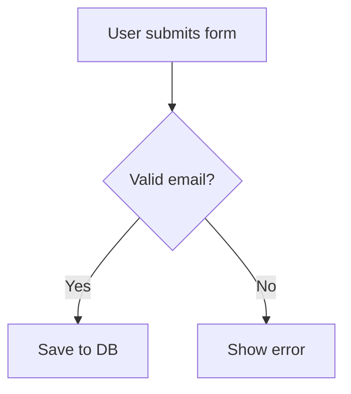
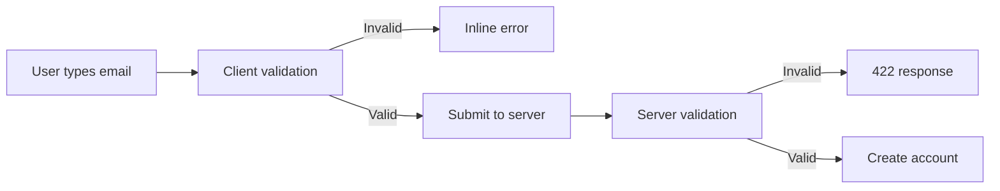

# Commit Text Generator

## Purpose
Generate a ready-to-paste commit message based on all work done since the last
commit. The message follows conventional commit format, includes a detailed body
with change bullets and testing notes, and is copied to the clipboard.

**This skill never includes AI attribution lines** (no `Co-Authored-By`, no bot
references). The output is indistinguishable from a human-written commit.

---

## When to Use

Suggested trigger phrases:
- Generate commit text
- Write me a commit message
- Commit text
- Prepare commit message

---

## Workflow

### 1. Gather Context

#### Git Changes
Collect everything that changed since the last commit:

```bash
# Staged changes
git diff --cached --stat
git diff --cached

# Unstaged changes
git diff --stat
git diff

# Untracked files
git status -s

# Last commit for reference
git log -1 --pretty=format:"%h %s"
```

#### Branch & Ticket ID
Extract the ticket ID from the current branch name:

```bash
git branch --show-current
```

Parsing rules:
- Branch like `feature/HAN-123-some-description` → scope is `HAN-123`
- Branch like `fix/PROJ-456-bug-title` → scope is `PROJ-456`
- Branch like `HAN-789-quick-fix` → scope is `HAN-789`
- Pattern: first segment matching `[A-Z]+-[0-9]+`
- If branch is `main`, `master`, `develop`, or no ticket ID is found → **omit the parenthetical scope entirely**

#### Conversation Context
Review the current conversation history for:
- What the user asked to be done
- Decisions made during implementation
- Manual or automated testing performed
- Any notable trade-offs or design choices

---

### 2. Ask the User for Commit Type

Present the options and ask the user to choose:

| Type | When to use |
|------|-------------|
| `feat` | A new feature or capability |
| `fix` | A bug fix |
| `chore` | Maintenance, dependencies, config |
| `refactor` | Code restructuring without behavior change |
| `docs` | Documentation only |
| `test` | Adding or updating tests |
| `style` | Formatting, whitespace, linting (no logic change) |
| `perf` | Performance improvement |
| `ci` | CI/CD pipeline changes |
| `build` | Build system or external dependency changes |

Ask: **"Which commit type fits this change?"** and wait for the user's response.

---

### 3. Compose the Commit Message

#### Subject Line Format

```
<type>(<TICKET-ID>): <concise imperative description>
```

Or without a ticket:

```
<type>: <concise imperative description>
```

Rules for the subject line:
- Use imperative mood ("Add feature" not "Added feature")
- Keep under 72 characters
- No trailing period
- Lowercase after the colon

#### Body

The body should include:

**1. Summary paragraph** — one or two sentences explaining the *why* behind the change.

**2. Changes section** — bullet list of what was done:

```
Changes:
- Added new validation logic for email fields
- Updated user model to include phone number
- Removed deprecated helper function
```

**3. Testing section** (if applicable):

```
Testing:
- Verified form submission with valid/invalid emails
- Ran existing unit test suite — all passing
- Manual smoke test of user profile page
```

**4. Mermaid diagram** (optional — include when the change involves):
- New or modified control flow
- Architecture changes
- Multi-component interactions
- Complex state transitions

Format the mermaid block so it renders on GitHub:

````

````

**5. Notes section** (optional — include when relevant):

```
Notes:
- Breaking change: removed `legacyAuth()` — callers must migrate to `authV2()`
- Related to HAN-456
```

---

### 4. Present and Copy

1. Display the full commit message in a fenced code block so the user can review it.
2. Copy it to the clipboard:

```bash
echo "<commit message>" | pbcopy
```

3. Confirm to the user: **"Copied to clipboard."**

---

### 5. Iterate if Needed

If the user wants changes:
- Adjust the message based on feedback
- Re-copy the updated version to the clipboard
- Confirm again

---

## Example Output

```
feat(HAN-123): add email validation to registration form

Prevent invalid emails from reaching the backend by adding client-side
validation with server-side fallback.

Changes:
- Added email regex validation to RegistrationForm component
- Added server-side email validation in UserController
- Updated error messages to show inline validation feedback
- Added EmailValidator utility class

Testing:
- Unit tests for EmailValidator (8 cases including edge cases)
- Integration test for registration endpoint with invalid email
- Manual test: verified inline error appears on blur



Notes:
- Client regex intentionally lenient — server is authoritative
```

---

## Rules

- **Never include AI attribution** — no `Co-Authored-By`, no bot signatures, no AI references.
- Always use imperative mood in the subject line.
- Keep the subject under 72 characters.
- Include a blank line between subject and body.
- Wrap body lines at 80 characters where practical.
- Only include the mermaid diagram when it adds genuine clarity.
- Always copy to clipboard using `pbcopy` (macOS).
- If the clipboard copy fails, still display the message and note the failure.

## Best Practices

- Pull details from the actual diff, not assumptions.
- Reference the conversation context for testing details and decision rationale.
- Keep bullets concise — each should be one line.
- Group related changes logically in the bullet list.
- Use the testing section to document both automated and manual testing.
