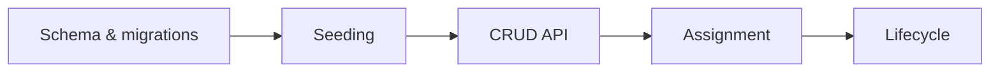
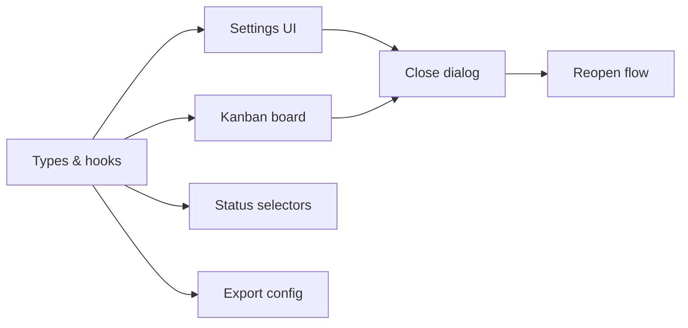

# Linear Project Slicer

## Purpose

Turn a Linear briefing document into a complete, ready-to-execute set of
vertically-sliced sub-issues for both frontend and backend work. Each issue
is written with enough technical depth that an AI agent can pick it up and
implement it without further clarification.

---

## When to Use

Trigger phrases:
- Plan the Linear issues for this document
- Slice up [Linear URL] into sub-issues
- Create the issues for [feature]
- Break [HAN-XXXX] into sub-issues

Required inputs from the user (ask if not provided):
1. **Linear briefing document URL** (e.g. `https://linear.app/handshaik/document/...`)
2. **Frontend parent issue** identifier (e.g. `HAN-2593`) — all FE sub-issues go under this
3. **Backend parent issue** identifier (e.g. `HAN-2594`) — all BE sub-issues go under this
4. **Assignees** (optional) — who owns FE work and who owns BE work? If not provided, leave unassigned.

---

## Issue Template

Every sub-issue must follow this exact format:

```markdown
## Description

[1–3 sentences of user value. What problem does this solve? What can the user
do after this ships that they couldn't before?]

**Figma reference:** [URL if applicable]

## Technical Aspects

- [Bullet list of specific technical tasks]
- [Pattern references: "follow the same pattern as X in file Y"]
- [Access control / auth considerations]
- [Testing requirements]

For **backend** issues, also include:
- Full method/function signatures with Python type hints
- REST endpoint spec: HTTP method, path, request body shape, response shape, error codes
- Validation rules in execution order
- Database query details (new columns, indexes, migrations)

For **frontend** issues, also include:
- Component names and hook signatures with TypeScript return types
- `data-pendo` attribute values for all new interactive elements
- URL state params (nuqs) if applicable

## Critical Files

- `path/to/file.ext` — [What changes here and why]
- `path/to/other/file.ext` — [What changes here and why]

## Acceptance Criteria

- [ ] [Specific, testable behaviour]
- [ ] [One criterion per checkbox]
- [ ] **Blocked by:** [Issue ID] if applicable

---

## Definition of Ready:

 *To be completed before an issue moves from Backlog to Ready*

- [ ] Clear user value in the description
- [ ] Acceptance criteria included
- [ ] Vertically sliced & Small enough
- [ ] Design included (if needed)
- [ ] Technical context clear
- [ ] No external blockers

---

## Definition of Done:

*To be completed before an issue moves from In Progress to Done*

- [ ] Code complete
- [ ] At least one other developer has approved the change, and it's been merged into the main branch.
- [ ] Tested
- [ ] Meets acceptance criteria
- [ ] Visible to a user
- [ ] No obvious bugs or TODOs left
- [ ] Deployed to production Code is released and accessible to users — even if behind a feature flag.
- [ ] Security implications checked (encryption, secure config/secrets, least privilege)
```

---

## Workflow

### Step 1 — Gather inputs

If the user hasn't provided the three required inputs, ask for them before proceeding.

Fetch the following in parallel:

```
mcp__plugin_linear_linear__get_document(id: <slugId or UUID from URL>)
mcp__plugin_linear_linear__get_issue(id: <FE parent>, includeRelations: true)
mcp__plugin_linear_linear__get_issue(id: <BE parent>, includeRelations: true)
mcp__plugin_linear_linear__list_issue_statuses(team: "Handshaik")
mcp__plugin_linear_linear__list_issue_labels(team: "Handshaik")
mcp__plugin_linear_linear__list_users()
```

From the statuses response, find the exact ID for the "Backlog" state (the one with
`"type": "backlog"` and `"name": "Backlog"`) — needed when creating issues.

From the labels response, identify existing labels for: track (`Backend`, `Frontend`),
type (`Feature`, `Bug`, `Improvement`), and feature area (e.g. `Nurture`). Note their
IDs. If any needed labels don't exist, create them later with `create_issue_label`.

If assignees were provided, resolve their names to user IDs from the users response.

Extract from the document:
- Feature description and goals
- Any Figma URLs linked in the document
- Referenced Linear projects or previous work
- Specific columns, filters, behaviours called out

---

### Step 2 — Explore the codebase (parallel agents)

Launch **two Explore agents in parallel** — one per repo. Tailor the prompt to
the feature being built. Always investigate:

**Frontend agent** (`/Users/jonathanisaacs/Documents/Git/Frontend-Dreamhouse`):
- Find all existing files related to the feature area (grep by feature name)
- Read the main feature component to understand tab/routing structure
- Find any existing placeholder components for this feature
- Find relevant API clients (`src/lib/api-clients/`)
- Find relevant hooks (`src/hooks/`)
- Find feature flags (`src/lib/flags.ts`)
- Find existing type definitions for related models
- Understand URL state patterns (nuqs usage)

**Backend agent** (`/Users/jonathanisaacs/Documents/Git/handshaik-app`):
- Find the relevant app module (e.g. `src/apps/nurture/`)
- Read the data models (`db/models/`) for entities involved
- Read existing API routes (`api/`) to understand endpoint patterns
- Read the service layer (`services/`) — find methods that can be reused or extended
- Read Pydantic schemas (`db/schemas/`) for request/response patterns
- Identify what data is already available vs what needs new queries
- Check for existing tests to understand testing patterns

---

### Step 3 — Fetch Figma design (if linked)

If the document contains a Figma URL:

```
mcp__plugin_figma_figma__get_design_context(
  fileKey: <extracted from URL>,
  nodeId: <extracted from URL, convert - to :>,
  clientFrameworks: "react,next.js",
  clientLanguages: "typescript"
)
```

Note any discrepancies between what the Figma shows and what the document
describes — these must be clarified with the user.

---

### Step 4 — Ask clarifying questions

Before designing the issue breakdown, ask the user any questions where the
document is ambiguous or where Figma and document specs conflict. Use
`AskUserQuestion` with up to 4 questions at once.

**Common questions to consider:**

- Column/metric discrepancies between Figma and document spec — which wins?
- Calculation definitions (e.g. "average time": calendar vs business days? active vs historical only?)
- UX interaction pattern (e.g. "click to see companies": navigate to existing view vs modal/sheet?)
- Feature flag name to use in Flagsmith
- Tab structure changes (new tab alongside existing vs replacing one)
- Pagination or data volume concerns for new endpoints
- Access control edge cases (org-scoped? user-scoped? shared data?)

Only ask questions that are genuinely blocking. If something is clearly
derivable from the document and existing code patterns, make the call and
document your assumption.

---

### Step 5 — Design the vertical slices

Design the minimum set of issues that:
1. Each deliver end-to-end user value (FE + BE paired where the user can see something new)
2. Can be worked on independently (unblock in order, not all at once)
3. Are small enough to be done in one PR

**Typical slice pattern for a new feature:**

| # | Type | Scope | Typical content | Estimate |
|---|------|-------|----------------|----------|
| 1 | BE | DB schema & migrations | Models + Alembic migration + seeding | 3 pts |
| 2 | BE | Default data seeding | Seed script + org-scoped defaults | 3 pts |
| 3 | BE | CRUD API | Service layer + routes + schemas + tests | 5 pts |
| 4 | BE | Business logic | Assignment, lifecycle, validation rules | 3 pts |
| 5 | BE | Advanced lifecycle | Close/reopen flows, audit trail | 2 pts |
| 6 | FE | Types, API client & hooks | Generated types + API client + query hooks + feature flag | 3 pts |
| 7 | FE | Settings / management UI | Full CRUD page with drag-and-drop, pickers | 5 pts |
| 8 | FE | Primary view migration | Main feature view (e.g. kanban board) | 5 pts |
| 9 | FE | Secondary components | Status selectors, progress indicators | 3 pts |
| 10 | FE | Dialogs & flows | Close dialog, reopen flow | 5 pts |
| 11 | FE | Peripheral updates | Export config, minor integrations | 1 pt |

Adjust based on complexity. Never split a single logical unit across issues
just to create more tickets. 3–6 issues per track is typical for a small feature;
larger features commonly reach 8–12 per track. Don't artificially constrain the
count — let the scope dictate it.

**Effort scale:**
- `1` = XS (< half a day — trivial wiring, config, tiny component)
- `2` = S (half to 1 day — small component + hook, simple endpoint)
- `3` = M (1–2 days — full feature slice with tests)
- `5` = L (2–3 days — complex feature, multiple files, edge cases)

**Priority:**
- `2` = High — on the critical path; blocks other issues
- `3` = Medium — dependent follow-on; can be done after blockers merge

#### Milestones

Group sub-issues into **~3 milestones per track** representing sequential phases.
Milestones help the team see progress at a glance and plan sprints.

Example milestone structure:
- **BE Track:** Data Foundation → Core API → Advanced Lifecycle
- **FE Track:** Foundation & Data Layer → Core UI Migration → Completion Flows

Each sub-issue must be assigned to exactly one milestone.

#### Dependency patterns

Design dependencies using one of two patterns:

**Sequential chain** (typical for BE where each step builds on the last):


**Fan-out** (typical for FE — foundation, then parallel streams, then convergence):


---

### Step 6 — Set up project and milestones

Check if a Linear Project already exists for this feature (the parent issues may
already belong to one). If not, create one:

```
mcp__plugin_linear_linear__save_project(
  name: "<Feature Name>",
  teamIds: ["<Handshaik team ID>"],
  leadId: "<user ID>",
  memberIds: ["<FE assignee ID>", "<BE assignee ID>"],
  startDate: "<today or sprint start>",
  targetDate: "<estimated completion>"
)
```

Then create milestones within the project (~3 per track, as designed in Step 5):

```
mcp__plugin_linear_linear__save_milestone(
  name: "BE: Data Foundation",
  projectId: "<project ID>",
  sortOrder: 0
)
```

Record all milestone IDs for use when creating issues.

---

### Step 7 — Create all sub-issues in parallel

Use `mcp__plugin_linear_linear__save_issue` for each issue simultaneously.

**Required fields for every issue:**
- `title`: plain descriptive title (e.g. "DB Schema & Migrations", "Kanban Board Migration"). No `FE:`/`BE:` prefix — the parent relationship and labels convey the track.
- `team`: `"Handshaik"`
- `project`: the project ID from Step 6
- `parentId`: FE issues → FE parent ID; BE issues → BE parent ID
- `milestoneId`: the milestone ID from Step 6 that this issue belongs to
- `priority`: `2` (High) or `3` (Medium) — see Step 5
- `estimate`: `1`, `2`, `3`, or `5` — see Step 5
- `state`: use the exact Backlog state ID retrieved in Step 1
- `labelIds`: at minimum include the track label (`Backend` or `Frontend`), type label (`Feature`), and feature-area label (e.g. `Nurture`)
- `assigneeId`: if assignees were provided, set the appropriate one (FE or BE owner)
- `description`: full content following the Issue Template above

---

### Step 8 — Wire dependencies in parallel

After all issues are created, set `blockedBy` relations.
Run all updates simultaneously. Use both dependency patterns from Step 5:

**Sequential chain** (BE):
```
mcp__plugin_linear_linear__save_issue(id: <seeding>, blockedBy: ["<schema>"])
mcp__plugin_linear_linear__save_issue(id: <CRUD>, blockedBy: ["<seeding>"])
mcp__plugin_linear_linear__save_issue(id: <assignment>, blockedBy: ["<CRUD>"])
mcp__plugin_linear_linear__save_issue(id: <lifecycle>, blockedBy: ["<assignment>"])
```

**Fan-out** (FE):
```
mcp__plugin_linear_linear__save_issue(id: <settings UI>, blockedBy: ["<types & hooks>"])
mcp__plugin_linear_linear__save_issue(id: <kanban board>, blockedBy: ["<types & hooks>"])
mcp__plugin_linear_linear__save_issue(id: <close dialog>, blockedBy: ["<settings UI>", "<kanban board>"])
mcp__plugin_linear_linear__save_issue(id: <reopen flow>, blockedBy: ["<close dialog>"])
```

Cross-track dependencies (FE blocked by BE) are also valid when the FE issue
needs an API that doesn't exist yet.

---

### Step 9 — Update both parent issues

Update the FE and BE parent issues with a clear overview of their sub-issues.
Run both updates in parallel.

**Parent issue title format:** `"Frontend: Feature Name"` / `"Backend: Feature Name"`

**Parent issue description format:**

```markdown
## Overview

[1–2 sentence summary of what this parent tracks and the recommended work order.]

**Briefing document:** [link]
**Figma:** [link if applicable]

---

## Sub-issues

| Issue | Title | Milestone | Effort | Priority | Blocked by |
|-------|-------|-----------|--------|----------|-----------|
| [HAN-XXXX](url) | Short title | Phase name | X pts | High/Medium | — or HAN-XXXX |

**Total estimate: X points**

---

## Dependency order

\`\`\`mermaid
graph LR
    HAN-XXXX[Short label] --> HAN-XXXX[Short label]
    HAN-XXXX --> HAN-XXXX[Short label]
    HAN-XXXX --> HAN-XXXX[Short label]
\`\`\`

---

## Feature summary

[2–4 sentences describing what the feature does from a user perspective,
what it is gated behind, and any key technical notes.]
```

---

### Step 10 — Update the briefing document

Update the Linear document by appending the following sections after the original
content. If the document already has Technical Design or Architecture sections,
update them rather than duplicating.

```markdown
---

## Confirmed Decisions

- **[Decision area]:** [What was decided and why]
- **[Decision area]:** [What was decided and why]
- **Feature flag name:** `flag_name_here` (create in Flagsmith, default OFF)

---

## Sub-issues

### Backend (under [HAN-XXXX](url))

| Issue | Title | Milestone | Estimate | Blocked by |
|-------|-------|-----------|----------|-----------|
| [HAN-XXXX](url) | Title | Phase name | X pts | — or HAN-XXXX |

### Frontend (under [HAN-XXXX](url))

| Issue | Title | Milestone | Estimate | Blocked by |
|-------|-------|-----------|----------|-----------|
| [HAN-XXXX](url) | Title | Phase name | X pts | — or HAN-XXXX |

### Dependency order

\`\`\`mermaid
graph LR
    HAN-XXXX[BE: Schema] --> HAN-XXXX[BE: Seeding] --> HAN-XXXX[BE: CRUD]
    HAN-XXXX[FE: Types & hooks] --> HAN-XXXX[FE: Settings UI]
    HAN-XXXX[FE: Types & hooks] --> HAN-XXXX[FE: Kanban board]
\`\`\`

---

## Deployment Strategy

[Recommended deployment order — typically: BE foundation first, then FE foundation,
then parallel UI work, then close/reopen flows, then feature flag rollout.]

---

## Scope Log

- **Initial plan:** X BE issues + Y FE issues = Z total (Z points)
- Issues may be added during implementation as edge cases and bugs surface.
  When adding, use the same parent/labels/project/milestone structure.
```

Use `mcp__plugin_linear_linear__update_document(id: <document UUID>)`.

---

## Technical Patterns (Handshaik-specific)

### Frontend

| Area | Pattern |
|------|---------|
| Feature flags | `FeatureFlags.nurture.xyz` in `src/lib/flags.ts`; wrap tab items in `<FeatureFlag flag={...}>` |
| API clients | Extend `BaseClient`; file in `src/lib/api-clients/`; method returns typed Promise |
| Data hooks | `useQueryWithAuth` pattern; query key as `['feature', param1, param2]`; file in `src/hooks/{feature}/` |
| URL state | `useQueryState` from `nuqs`; never use React state for filter/tab params |
| Components | Max 100 lines; feature components in `src/features/{feature}/`; shared UI in `src/components/ui/` |
| Pendo tracking | `data-pendo="{feature}-{action}"` on every interactive element and page root |
| Navigation | `router.push(...)` from `next/navigation`; preserve search params when switching tabs |
| Types | Generated types from OpenAPI in `src/types/`; manual types only when no generated equivalent |

### Backend (FastAPI / Python)

| Area | Pattern |
|------|---------|
| Auth | `request.state.user` (JWTUser with org context); `request.state.db` (AsyncSession) |
| Routes | `src/apps/{module}/api/{router}.py`; follow existing route naming conventions |
| Services | `src/apps/{module}/services/{service}.py`; business logic only, no direct DB in routes |
| Schemas | Pydantic v2 in `src/apps/{module}/db/schemas/`; `{Resource}Response`, `{Resource}Request` naming |
| DB queries | SQLAlchemy 2.0 async; filter `deleted_at IS NULL` for soft-delete models |
| Access control | Check `TargetListUsers` or `TargetListAccessControl`; return 403 for unauthorised |
| Tests | `src/apps/{module}/tests/unit/api/`; use `AsyncMock` for service mocking |
| Indexes | If adding a new filter column to a large table, add an Alembic migration with an index |

---

## Quality Checklist

Before finishing, verify each issue:

- [ ] Could an AI agent implement this issue without asking any questions?
- [ ] Are all file paths specific and correct (verified against the codebase)?
- [ ] Are code snippets accurate (types, function signatures, imports)?
- [ ] Does every issue have an `estimate`, `priority`, and `state` = Backlog?
- [ ] Is the `blockedBy` dependency chain correct and complete?
- [ ] Do both parent issues have an overview table of their sub-issues?
- [ ] Does the briefing document now link to all created issues?
- [ ] Are `data-pendo` attributes specified for all new interactive elements?
- [ ] Is the Flagsmith flag name specified for gated features?
- [ ] Do acceptance criteria match what the briefing document and Figma describe?
- [ ] Are all sub-issues assigned to a milestone?
- [ ] Do all sub-issues have appropriate labels (track + type + feature area)?

---

## Scope Growth

**Scope growth is normal.** The initial slice is a starting point. During
implementation, expect 15–30% growth as bugs surface, edge cases emerge, and
designs evolve. When adding new issues mid-flight:

- Create them under the same parent with the same labels, project, and milestone.
- Set `estimate`, `priority`, and `state` = Backlog.
- Update the dependency graph on the parent issue description.
- If a ticket is superseded, archive it rather than deleting it.
- Update the Scope Log in the briefing document.
