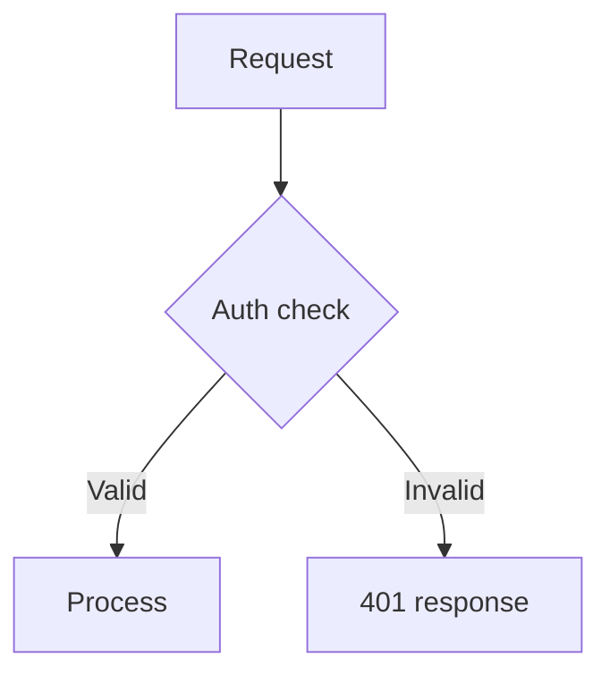

# Linear Ticket Updater

## Purpose
Keep Linear tickets in sync with implementation progress. After working on a
feature or fix, this skill updates the ticket to reflect what was actually built
— not just what was originally planned.

It ensures:
- The ticket title accurately describes the implemented work.
- The description contains structured implementation details.
- Technical aspects and acceptance criteria are filled in from real work.
- Definition of Ready / Definition of Done checklists are checked off as appropriate.

---

## When to Use

Use this skill when:
- You've finished implementing work on a branch tied to a Linear ticket.
- A ticket's description is empty or outdated relative to what was built.
- You want to sync the ticket with the current state of the code.

Suggested trigger phrases:
- Update the Linear ticket
- Sync the ticket with what we did
- Update ticket description
- Refresh the Linear issue

---

## Workflow

### 1. Extract Ticket ID from Branch

```bash
git branch --show-current
```

Parsing rules:
- Branch like `feature/HAN-123-some-description` → ticket ID is `HAN-123`
- Branch like `fix/PROJ-456-bug-title` → ticket ID is `PROJ-456`
- Branch like `HAN-789-quick-fix` → ticket ID is `HAN-789`
- Pattern: first segment matching `[A-Z]+-[0-9]+`
- If no ticket ID is found → **stop and ask the user** for the ticket identifier

---

### 2. Fetch Current Ticket State

Use the Linear MCP tool to retrieve the ticket:

```
mcp__plugin_linear_linear__get_issue(issueId: "<TICKET-ID>")
```

Capture:
- Current title
- Current description (may be empty)
- Current status
- Any existing labels or metadata

---

### 3. Gather Implementation Context

#### Git Changes
Collect what was done on this branch:

```bash
# All commits on this branch since diverging from main
git log main..HEAD --oneline

# Full diff against main
git diff main...HEAD --stat
```

#### Conversation Context
Review the current conversation history for:
- What the user asked to be done
- Decisions made during implementation
- Trade-offs or design choices
- Testing performed (manual or automated)
- Architecture or flow changes

---

### 4. Update the Title

Refine the ticket title to reflect what was actually implemented:

- Use imperative mood ("Add email validation" not "Added email validation")
- Keep concise — under 80 characters
- Be specific about what was built, not what was planned
- Preserve the ticket's project prefix conventions if any

---

### 5. Update the Description

#### If the description is empty or minimal
Populate using the full template structure below.

#### If the description already has content
Update the existing sections — preserve any content the user or others wrote
that is still accurate. Add implementation details to the relevant sections.
Do not delete information that is still valid.

---

### 6. Write Updates to Linear

Use the Linear MCP tool to save:

```
mcp__plugin_linear_linear__save_issue(
  issueId: "<TICKET-ID>",
  title: "<updated title>",
  description: "<updated description>"
)
```

Write directly — no confirmation step.

---

## Description Template

When populating an empty ticket, use this structure:

```markdown
## Description
<!-- One or two paragraphs explaining what was done and why -->

## Technical Aspects:
<!-- Bullet list of implementation details -->

## Acceptance Criteria
<!-- Checkboxes for what was built and verified -->

---

## Definition of Ready:
*To be completed before an issue moves from Backlog to Ready*
- [ ] Clear user value in the description
- [ ] Acceptance criteria included
- [ ] Vertically sliced & Small enough
- [ ] Design included (if needed)
- [ ] Technical context clear
- [ ] No external blockers

---

## Definition of Done:
*To be completed before an issue moves from In Progress to Done*
- [ ] Code complete
- [ ] At least one other developer has approved the change, and it's been merged into the main branch.
- [ ] Tested
- [ ] Meets acceptance criteria
- [ ] Visible to a user
- [ ] No obvious bugs or TODOs left
- [ ] Deployed to production Code is released and accessible to users — even if behind a feature flag.
- [ ] Security implications checked (encryption, secure config/secrets, least privilege)
```

### Filling in the Template

**Description** — Write what was done and why. Reference the user's original
request and any key decisions. Include mermaid diagrams when the work involves
architecture or flow changes:

````

````

**Technical Aspects** — List implementation details as bullets:
- Files changed and why
- New dependencies or APIs introduced
- Database or schema changes
- Configuration changes
- Performance considerations

**Acceptance Criteria** — Convert what was built into checkboxes. Check off
items that are verified:
- [x] User can submit the form with valid email
- [x] Invalid emails show inline error message
- [ ] Email verification link is sent (planned, not yet implemented)

**Definition of Ready** — Check off items that are satisfied based on the
ticket's current state.

**Definition of Done** — Check off items that are complete. Typically after
implementation:
- [x] Code complete
- [ ] At least one other developer has approved (pending PR review)
- [x] Tested
- [x] Meets acceptance criteria

---

## Formatting Guidelines

- Use markdown headings, bullet lists, and code blocks.
- Include mermaid diagrams when the work involves architecture or flow changes.
- Keep bullets concise — one line each.
- Use code blocks for file paths, commands, or code references.
- Check off Definition of Ready/Done items that are satisfied.

---

## Rules

- Always extract the ticket ID from the branch — never guess.
- If no ticket ID is found, ask the user.
- Never remove valid existing content from a ticket description.
- Always fetch the current ticket state before updating.
- Write directly to Linear — no confirmation step needed.
- Use imperative mood in the title.
- Include mermaid diagrams only when they add genuine clarity.
- Pull details from the actual diff and conversation, not assumptions.

## Best Practices

- Review the full diff against main, not just the latest commit.
- Reference conversation context for decisions and trade-offs.
- Be honest about what's done vs. what's still pending in acceptance criteria.
- Group technical aspects logically (frontend, backend, infra, etc.).
- Keep the description useful for reviewers and future readers.
