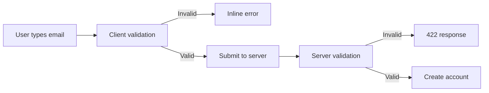

# PR Content Generator

## Purpose
Generate a ready-to-paste pull request title and body based on all work done on
the current branch. The content uses GitHub-flavored markdown, includes mermaid
diagrams when they add clarity, and is copied to the clipboard.

**This skill never includes AI attribution lines** (no `Co-Authored-By`, no bot
references, no "Generated with" footers). The output is indistinguishable from
a human-written PR.

---

## When to Use

Suggested trigger phrases:
- Generate PR content
- Write me a PR description
- PR content
- Prepare PR description
- Draft pull request

---

## Workflow

### 1. Gather Context

#### Current Branch & Base Branch

```bash
# Current branch
git branch --show-current

# Auto-detect base branch (check in order: main, master, develop)
git rev-parse --verify main 2>/dev/null && echo "main" \
  || git rev-parse --verify master 2>/dev/null && echo "master" \
  || git rev-parse --verify develop 2>/dev/null && echo "develop"
```

If the base branch is ambiguous or the user specifies one, use their override.
Do not ask unless detection fails.

#### Diff Against Base

```bash
# Summary of changes
git diff <base>...HEAD --stat

# Full diff (primary source of truth)
git diff <base>...HEAD

# Commit log for additional context
git log <base>..HEAD --oneline
```

#### Branch & Ticket ID
Extract the ticket ID from the current branch name:

```bash
git branch --show-current
```

Parsing rules:
- Branch like `feature/HAN-123-some-description` -> scope is `HAN-123`
- Branch like `fix/PROJ-456-bug-title` -> scope is `PROJ-456`
- Branch like `HAN-789-quick-fix` -> scope is `HAN-789`
- Pattern: first segment matching `[A-Z]+-[0-9]+`
- If branch is `main`, `master`, `develop`, or no ticket ID is found -> **omit the ticket reference entirely**

#### Conversation Context
Review the current conversation history for:
- What the user asked to be done
- Decisions made during implementation
- Manual or automated testing performed
- Any notable trade-offs or design choices

---

### 2. Compose the PR Content

#### Title

```
<type>(<TICKET-ID>): <concise description>
```

Or without a ticket:

```
<type>: <concise description>
```

Rules for the title:
- Use imperative mood ("Add feature" not "Added feature")
- Keep under 72 characters
- No trailing period
- Lowercase after the colon
- Type is one of: `feat`, `fix`, `chore`, `refactor`, `docs`, `test`, `style`, `perf`, `ci`, `build`

If the conventional commit prefix doesn't fit the team style, use a plain
descriptive title instead.

#### Body

The body uses GitHub-flavored markdown with the following sections.
**Omit any section that would be empty.**

**1. Summary** -- one to three sentences explaining the *why* behind the change.

```markdown
## Summary

Prevent invalid emails from reaching the backend by adding client-side
validation with server-side fallback.
```

**2. Changes** -- bullet list of what was done:

```markdown
## Changes

- Added email regex validation to RegistrationForm component
- Added server-side email validation in UserController
- Updated error messages to show inline validation feedback
- Added EmailValidator utility class
```

**3. Testing** -- how the changes were tested:

```markdown
## Testing

- [ ] Unit tests for EmailValidator (8 cases including edge cases)
- [ ] Integration test for registration endpoint with invalid email
- [ ] Manual test: verified inline error appears on blur
```

Use GitHub checkboxes (`- [ ]`) so the reviewer can check them off.

**4. Diagrams** -- mermaid diagrams for architecture or flow changes (only when they add genuine clarity):

````markdown
## Architecture


````

Include mermaid diagrams when the change involves:
- New or modified control flow
- Architecture changes
- Multi-component interactions
- Complex state transitions

**5. Breaking Changes** -- if any:

```markdown
## Breaking Changes

- Removed `legacyAuth()` -- callers must migrate to `authV2()`
```

**6. Related Tickets** -- linked ticket IDs:

```markdown
## Related Tickets

- HAN-123
- HAN-456
```

---

### 3. Present and Copy

1. Display the full PR content in a fenced code block with the title on the first line, a blank line, then the body.
2. Copy it to the clipboard:

```bash
echo "<pr content>" | pbcopy
```

3. Confirm to the user: **"Copied to clipboard."**

---

### 4. Iterate if Needed

If the user wants changes:
- Adjust the content based on feedback
- Re-copy the updated version to the clipboard
- Confirm again

---

## Example Output

```
feat(HAN-123): add email validation to registration form

## Summary

Prevent invalid emails from reaching the backend by adding client-side
validation with server-side fallback.

## Changes

- Added email regex validation to RegistrationForm component
- Added server-side email validation in UserController
- Updated error messages to show inline validation feedback
- Added EmailValidator utility class

## Testing

- [ ] Unit tests for EmailValidator (8 cases including edge cases)
- [ ] Integration test for registration endpoint with invalid email
- [ ] Manual test: verified inline error appears on blur

## Architecture


## Related Tickets

- HAN-123
```

---

## Rules

- **Never include AI attribution** -- no `Co-Authored-By`, no bot signatures, no AI references, no "Generated with" footers.
- Always use imperative mood in the title.
- Keep the title under 72 characters.
- Include a blank line between the title and body.
- Use GitHub-flavored markdown (headings, checkboxes, code blocks, mermaid).
- Only include mermaid diagrams when they add genuine clarity.
- Omit sections that would be empty.
- The diff against base branch is the primary source of truth -- not the commit log.
- Auto-detect the base branch; only ask the user if detection fails.
- Always copy to clipboard using `pbcopy` (macOS).
- If the clipboard copy fails, still display the content and note the failure.

## Best Practices

- Pull details from the actual diff, not assumptions.
- Reference the conversation context for testing details and decision rationale.
- Keep bullets concise -- each should be one line.
- Group related changes logically in the bullet list.
- Use the testing section to document both automated and manual testing.
- Use checkboxes in the testing section so reviewers can verify.
- Prefer smaller, focused summaries over exhaustive descriptions.
